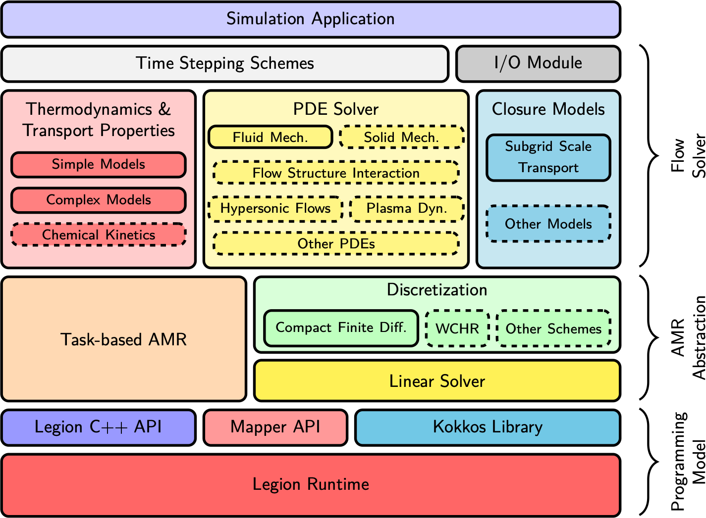

{}
AMR-H is under a rapid development. The detailed documentation will be released soon.
{}

## What is it?
AMR-H is a high performance computating infrastructure for compressible flow simulations with adaptive mesh refinement (AMR).
It is designed as a computational fluid dynamics (CFD) tookit satisfying the demands in higher education and scientific research in academia and industry.
The software is open source relased under the [Apache 2.0 License](https://www.apache.org/licenses/LICENSE-2.0) and completely free for all users. 

## Why do I want it?
AMR-H as an infrastructure helps reduce the unecessary complexity in the research of computational physics.
It automatically configures the strategies of parallel computing for large size simulations, and guarantees a portable performance on different types of high performance computing platforms.
Additionally, AMR-H integrates many state-of-the-art high-order numerical schemes, computational algorithms, and physical models.
AMR-H has a flexible extensibility.
The user can add or change the existing models, modify the built-in governing equations, or even configure a new solver using the built-in numerical schemes.
The numerical schemes provided in AMR-H can be also used in data processing.
As the result, user can better focus on the investigation of the physical or engineering problem of interest.

## Basic structure and available modules

